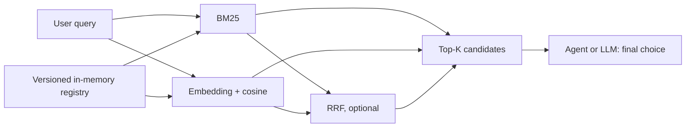

# Tool Router

Retrieve relevant tools before an LLM has to inspect every tool schema.

Tool Router is a Java 21 library for **candidate retrieval**. It stores tool definitions in memory and offers Lucene BM25, embedding cosine search, and RRF fusion. It does not execute tools or choose the final tool for an agent.

## Why

As a tool catalog grows, sending every schema to an LLM increases prompt size and adds confusing near matches. A retriever can narrow the catalog to Top-K candidates. The agent still makes the final decision because it may need conversation context, argument validation, authorization, and execution policy that a relevance score does not contain.

## Architecture



## Quick start

Requires Java 21 and Maven.

```bash
mvn clean verify
mvn -q exec:java -Dexec.mainClass=io.github.toolrouter.Example
```

```java
InMemoryToolRegistry registry = new InMemoryToolRegistry();
registry.register(new ToolDefinition(
    "refund_order", "Return money for a paid order",
    List.of("order", "refund", "payment"), null));

try (BM25ToolRouter router = new BM25ToolRouter(registry)) {
    RouteResponse response = router.routeWithHint(
        "I want a refund for yesterday's order", 5);
    response.candidates().forEach(candidate ->
        System.out.println(candidate.rank() + ". " + candidate.tool().name()));
}
```

The registry supports `register`, `update`, `remove`, `get`, `list`, and `size`. Names are unique. Mutations become visible on subsequent route calls.

The CLI example accepts `--router bm25|vector|hybrid` plus query words. Vector and hybrid modes use environment variables:

| Variable | Purpose | Default |
|---|---|---|
| `DASHSCOPE_API_KEY` | API credential, read only from the environment | Required for vector/hybrid |
| `EMBEDDING_BASE_URL` | OpenAI-compatible base URL | `https://dashscope.aliyuncs.com/compatible-mode/v1` |
| `EMBEDDING_MODEL` | Embedding model | `text-embedding-v4` |
| `EMBEDDING_DIMENSIONS` | Vector dimension | `1024` |

The default URL remains supported, but Alibaba Cloud recommends a workspace-specific base URL. Use the endpoint for your region and workspace. The [official compatible API documentation](https://help.aliyun.com/zh/model-studio/embedding-interfaces-compatible-with-openai) specifies the URL and request format; the [synchronous API reference](https://help.aliyun.com/zh/model-studio/text-embedding-synchronous-api/) lists model dimensions and the 10-text batch limit for V4. No credential is stored in the repository.

## Routing strategies

**BM25:** Lucene indexes name, tags, and description as separate fields. Default weights are 1/1/1, avoiding an unevaluated field preference. Positive weights can be set in the constructor. The index is refreshed from a versioned registry snapshot after a mutation.

**Embedding:** `EmbeddingProvider` is provider-agnostic and batch-oriented. `OpenAiCompatibleEmbeddingProvider` uses Java `HttpClient`, accepts base URL, API key, model, dimensions and batch size, and checks response dimensions and indices. For Alibaba Cloud V4 it sends `model`, `input`, `dimensions`, and `encoding_format=float` to `/embeddings` in chunks of at most 10. `VectorToolRouter` caches tool vectors for the registry version, scores cosine similarity, and keeps Top-K in a heap.

**Hybrid:** `HybridToolRouter` independently retrieves candidates from BM25 and embedding search, then computes `sum(1 / (rrfK + rank))` per tool. The default `rrfK` is 60 and candidate pool is 50; both are configurable. RRF combines ranks because BM25 and cosine scores have different scales. Fusion is optional: the benchmark below shows that equal-rank fusion can hurt when one retriever is substantially weaker on the query set.

**Score-gap hint:** `routeWithHint` returns the relative gap between the top two scores. It recommends fallback for fewer than two candidates, a nonpositive top score, or a gap below 0.1. This is a within-query heuristic, **not a calibrated probability or correctness estimate**. The threshold is a conservative example; callers should validate fallback policy on their own data. A fallback can expose more schemas to the agent.

## Benchmark

`benchmark/dataset.tsv` contains 100 tools and 200 labeled queries in 20 domains, with one keyword-oriented and one natural-language hard query per tool. Similar actions within a domain serve as hard negatives. The benchmark reads the TSV directly; `python benchmark/build_dataset.py` can export an ignored JSON copy. There is no training step or dataset-specific routing rule. This manually authored diagnostic set is small and English-only; it should not be treated as a general accuracy claim.

```bash
# Retrieval accuracy and retrieval-only scaling; add --cached-only to reuse existing real vectors without a key.
mvn -q exec:java "-Dexec.mainClass=io.github.toolrouter.Benchmark" "-Dexec.args=--scaling"
# With DASHSCOPE_API_KEY set, also measure uncached online query embedding latency.
mvn -q exec:java "-Dexec.mainClass=io.github.toolrouter.Benchmark" "-Dexec.args=--online"
```

The benchmark uses real `text-embedding-v4` vectors at 1024 dimensions by default. It persists vectors under ignored `.benchmark-cache/`, keyed by endpoint, model, dimension, and exact text; credentials are never cached. Retrieval-only runs prefetch tool **and query** vectors. `--cached-only` reuses previously saved real vectors and fails if an entry is missing. No secret or external API is needed for unit tests or CI.

Measured on Windows 11, Eclipse Temurin 21.0.12.1, Maven 3.9.9, Lucene 10.5.1, 2026-09-23. Accuracy uses all 200 queries, with 20 warmup queries per strategy. MRR is truncated at rank 5.

| Router | Recall@1 | Recall@3 | Recall@5 | MRR@5 |
|---|---:|---:|---:|---:|
| BM25 | 0.540 | 0.650 | 0.675 | 0.594 |
| Embedding | 0.675 | 0.875 | 0.940 | 0.777 |
| Hybrid RRF | 0.615 | 0.770 | 0.825 | 0.699 |

### Retrieval-only latency

**Retrieval-only latency excludes query embedding API calls and tool-index construction.** Query vectors are already cached, so the roughly 0.095 ms Embedding P50 describes cached-vector cosine scan and Top-K, **not real online Agent routing latency**. The following P50/P95 values are from a complete 200-query run using previously cached real model vectors:

| Router | P50 ms | P95 ms |
|---|---:|---:|
| BM25 | 0.433 | 1.083 |
| Embedding | 0.094 | 0.117 |
| Hybrid RRF | 0.430 | 0.883 |

The 100 hard queries alone retain the same accuracy pattern:

| Router | Recall@1 | Recall@3 | Recall@5 | MRR@5 |
|---|---:|---:|---:|---:|
| BM25 | 0.170 | 0.310 | 0.350 | 0.242 |
| Embedding | 0.500 | 0.810 | 0.890 | 0.654 |
| Hybrid RRF | 0.310 | 0.550 | 0.650 | 0.442 |

Embedding is the strongest strategy on this set. Among hard queries, Vector gets Top-1 right while Hybrid gets it wrong on 26 cases; BM25 gets Top-1 right while Hybrid gets it wrong on 3, and Hybrid alone recovers 4. **Equal-weight RRF can hurt when lexical retrieval is materially weaker than semantic retrieval on hard paraphrase queries.** The dataset and default fusion parameters were not altered to make hybrid win.

### Online / end-to-end routing latency

**Online latency includes one remote query embedding API call per route but excludes tool-index construction.** Tool embeddings are prebuilt and cached; each query bypasses the query cache and calls the existing OpenAI-compatible provider. The run used real DashScope `text-embedding-v4`, 50 queries selected with seed 42, three untimed warmup calls per strategy, and one timed route per query per strategy. Requests were sequential. The values reflect that run's network and service conditions, not a latency guarantee.

| Router | E2E P50 ms | E2E P95 ms |
|---|---:|---:|
| Embedding | 133.466 | 217.064 |
| Hybrid RRF | 146.280 | 277.055 |

### Retrieval-only scaling

The scaling run uses the same 50 seed-42 queries at each size. Each router/index and all tool/query vectors are ready before timing; 10 complete warmup rounds are discarded, then 20 rounds yield 1,000 measured route latencies per size and strategy. It uses synthetic copies of the tools only for latency, so accuracy is not reported. Values below are P50/P95 in milliseconds from the revised protocol using cached real vectors:

| Tools | BM25 | Embedding | Hybrid |
|---:|---:|---:|---:|
| 100 | 0.133 / 0.229 | 0.156 / 0.185 | 0.415 / 0.580 |
| 500 | 0.117 / 0.196 | 0.502 / 0.774 | 0.751 / 1.170 |
| 1000 | 0.129 / 0.194 | 1.003 / 1.531 | 1.411 / 2.119 |

Sub-millisecond JVM microbenchmarks are sensitive to JIT, GC and host load. BM25 is an inverted-index search whose cost also depends on matching terms, so its P50 need not rise monotonically with catalog size. The small differences across these BM25 rows should not be interpreted as a scaling advantage.

## Design decisions and complexity

A few hundred or thousand tools fit in process memory. A dedicated vector database such as Milvus would add deployment and synchronization costs without changing the linear-scan bottleneck at this scale. The vector search is `O(ND + N log K)` per query and `O(ND)` in memory; N is tool count, D vector width, K requested candidates. Refreshing all vectors after a registry mutation takes O(N) embeddings, batched by the provider. BM25 uses an inverted index, with full reindexing on registry version changes. RRF fusion uses O(P log P) time and O(P) space for P retrieved candidates.

The registry serializes writes and publishes immutable snapshots through a volatile reference; reads do not lock. BM25 holds a per-router read lock during search and checks the snapshot version under that lock, preventing index/map mismatch; refresh takes the write lock and closes the replaced reader and directory. Closing the router releases Lucene resources. Vector search reads an immutable index snapshot; refresh is synchronized, while the common route path is lock-free. A concurrent mutation may yield a route against an older but internally consistent snapshot; the next route refreshes. The provider is immutable. The benchmark cache is synchronized and persists completed vectors without credentials.

## Limitations and roadmap

The benchmark is small and English-only. Embedding calls incur provider cost and latency outside the hot-vector routing numbers. Delete `.benchmark-cache/` when changing a model behind the same alias to avoid stale vectors. Registry writes trigger full snapshot copies; BM25 reindexes on change and vector refresh re-embeds all tools. The score-gap hint is not calibrated. There is no persistence of registry metadata, tool execution, or automatic fallback. A useful next step is a held-out multilingual evaluation and an incremental index update path, while keeping this a library rather than an agent platform.

## Development and license

`mvn clean verify` runs offline tests with deterministic embedding stubs and a loopback HTTP server; CI runs the same command on Java 21 without secrets or external model calls. Apache License 2.0: see [LICENSE](LICENSE).
