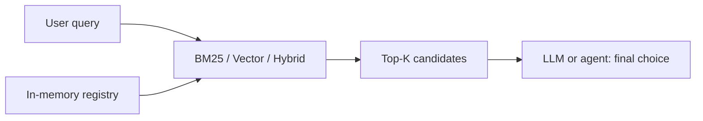

# Tool Router

Retrieve a small set of relevant tools before an LLM selects which one to call.

Tool Router is a Java library for candidate retrieval, not an agent or a tool executor. It keeps tool metadata in memory, retrieves with Lucene BM25 or cosine similarity, and can combine the rankings with reciprocal rank fusion (RRF).

## Why

Passing every available tool schema to an LLM grows the prompt and makes similar tools harder to distinguish. This library returns a Top-K shortlist. The caller still makes the final decision and can use the uncertainty signal to widen its search.

## Architecture



## Quick start

Requires Java 17 or later and Maven. Java 21 also works with the Java 17 release target.

```bash
mvn clean verify
mvn -q exec:java -Dexec.mainClass=io.github.toolrouter.Example
```

```java
InMemoryToolRegistry registry = new InMemoryToolRegistry();
registry.register(new ToolDefinition(
    "refund_order", "Return money for a paid order",
    List.of("order", "refund", "payment"), null));

try (BM25ToolRouter router = new BM25ToolRouter(registry)) {
    RouteResponse response = router.routeWithConfidence(
        "I want a refund for yesterday's order", 5);
    response.candidates().forEach(candidate ->
        System.out.println(candidate.rank() + ". " + candidate.tool().name()));
}
```

The registry supports `register`, `update`, `remove`, `get`, `list`, and `size`. Names are unique. Updating or removing a tool is visible on the next route call. The example class accepts query text as command-line arguments.

## Routing strategies

**BM25.** Lucene indexes name, tags, and description in separate fields. The default field weights are 1/1/1 to avoid an unvalidated preference. The constructor accepts positive name, tag, and description boosts for experiments. The index is rebuilt from a versioned registry snapshot after a mutation.

**Embedding.** `EmbeddingProvider` accepts batches. `OpenAiCompatibleEmbeddingProvider` calls an OpenAI-compatible `/embeddings` endpoint via Java `HttpClient`; configure base URL, model, and optional API key in code or environment variables. No key is hard coded. `VectorToolRouter` builds retrieval text from name, description, and tags, caches vectors by registry version, and linearly scans with cosine similarity and a size-K heap. It does not need a vector database. Provider/model changes require constructing a new router.

**Hybrid.** `HybridToolRouter` requests a pool of candidates from each retriever and sums `1 / (rrfK + rank)` per tool. Default `rrfK=60` and pool size 50 are configurable. It does not combine raw BM25 and cosine scores, whose scales differ.

**Uncertainty.** `routeWithConfidence` reports a relative gap between the first two scores and recommends fallback when fewer than two candidates are returned, the first has no positive score, or the gap is below 0.1. This is an advisory, uncalibrated signal. A fallback can be a larger Top-K or an LLM call with more schemas. The router does not decide which tool to execute.

## Benchmark

`benchmark/dataset.json` contains 100 tools and 200 labeled queries across 20 domains, with two difficulty levels per tool. Similar actions within each domain are deliberate hard negatives. `benchmark/dataset.tsv` is the reviewable source; `python benchmark/build_dataset.py` reproduces the JSON. Queries include literal keywords and natural paraphrases. This dataset is a small, manually written diagnostic set, not an independent test corpus. No model was trained on it.

```bash
mvn -q compile exec:java -Dexec.mainClass=io.github.toolrouter.Benchmark -Dexec.args=--scaling
```

For a real vector and hybrid run, set `EMBEDDING_BASE_URL`, `EMBEDDING_MODEL`, and, if required, `EMBEDDING_API_KEY`. The API cost and latency then depend on that provider. Unit tests use a deterministic local embedding stub; it is not presented as a semantic model.

Measured on a local Windows 11 machine, Java 17, Maven 3.9.9, Lucene 8.11.1, 2026-09-23. Single process, 20 warmup queries; latency is per query with Top-5 retrieval. MRR is truncated at rank 5. Timings are indicative and should be rerun on your hardware.

| Router | Recall@1 | Recall@3 | Recall@5 | MRR@5 | P50 ms | P95 ms |
|---|---:|---:|---:|---:|---:|---:|
| BM25 | 0.540 | 0.650 | 0.675 | 0.594 | 0.340 | 0.750 |
| Vector | Not measured | Not measured | Not measured | Not measured | Not measured | Not measured |
| Hybrid | Not measured | Not measured | Not measured | Not measured | Not measured | Not measured |

Scaling run (BM25, first 50 queries, 20 warmup, synthetic copies of dataset tools):

| Tools | P50 ms | P95 ms |
|---:|---:|---:|
| 50 | 0.180 | 0.444 |
| 100 | 0.174 | 0.447 |
| 500 | 0.198 | 0.615 |
| 1000 | 0.251 | 0.502 |

The BM25 score shows the limit of token overlap on paraphrases; it is not evidence of embedding or hybrid gains. The scaling run tests query latency after indexing, not index build time. JVM warmup, GC, and host load affect these small timings.

## Design decisions and complexity

The registry publishes immutable, versioned snapshots. Its writes are serialized; reads take a volatile snapshot without locking. BM25 protects index swaps and searches with a per-router read/write lock, so a search sees one consistent index and tool map. Vector builds a new immutable index after a registry version change; the common read path does not lock. Concurrent mutations can make a route use a slightly older snapshot, but each response is internally consistent and a later route catches up. Registry updates do not call external embedding APIs until the vector router is queried.

| Operation | Time | Extra space |
|---|---|---|
| Registry mutation | O(N) copy | O(N) snapshot |
| BM25 query | Lucene inverted-index search; corpus dependent | O(K) hits |
| BM25 refresh | O(N) reindex | O(N) index |
| Vector refresh | O(N) embedding calls in one batch | O(ND) |
| Vector query | O(ND + N log K) | O(K) |
| Hybrid query | Sum of retriever costs plus O(P log P) fusion | O(P) |

Here N is tool count, D is embedding dimension, K is requested results, and P is the union of retrieved candidates. Snapshot copies and full reindexing favor a few hundred to a few thousand tools with occasional mutations over very high write rates.

## Limitations and roadmap

The benchmark is English-only and small. BM25 uses Lucene's standard analyzer; there is no language-specific stemming. Embedding quality depends on the external model. Confidence is not calibrated. There is no persistence, schema execution, or automatic fallback. Future work can add a separately evaluated multilingual dataset and a local model adapter without expanding this library into an agent platform.

## Development

Run `mvn clean verify`; CI runs the same command on push and pull request without secrets. Benchmarking is opt-in. Public types have Javadoc, and the test suite covers mutation, ranking, similarity, fusion, and edge cases.

## License

Apache License 2.0. See [LICENSE](LICENSE).
