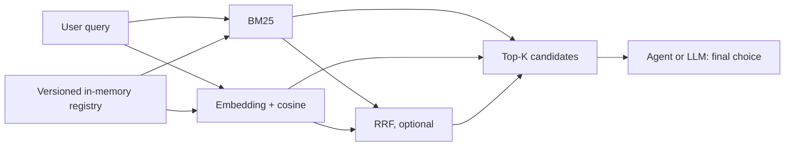

# Architecture

## Design decisions and complexity

A few hundred or thousand tools fit in process memory. A dedicated vector database such as Milvus would add deployment and synchronization costs without changing the linear-scan bottleneck at this scale. The vector search is `O(ND + N log K)` per query and `O(ND)` in memory; N is tool count, D vector width, K requested candidates. Refreshing all vectors after a registry mutation takes O(N) embeddings, batched by the provider. BM25 uses an inverted index, with full reindexing on registry version changes. RRF fusion uses O(P log P) time and O(P) space for P retrieved candidates.

The registry serializes writes and publishes immutable snapshots through a volatile reference; reads do not lock. BM25 holds a per-router read lock during search and checks the snapshot version under that lock, preventing index/map mismatch; refresh takes the write lock and closes the replaced reader and directory. Closing the router releases Lucene resources. Vector search reads an immutable index snapshot; refresh is synchronized, while the common route path is lock-free. A concurrent mutation may yield a route against an older but internally consistent snapshot; the next route refreshes. The provider is immutable. The benchmark cache is synchronized and persists completed vectors without credentials.
